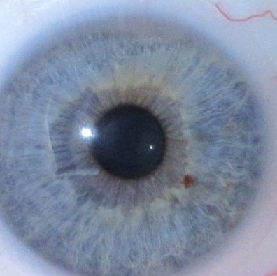
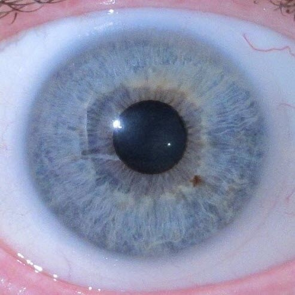
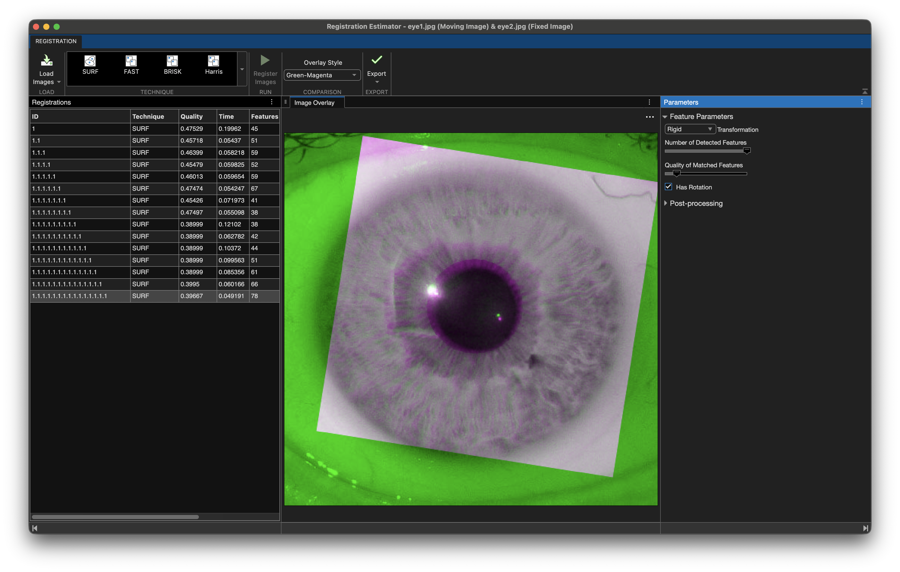
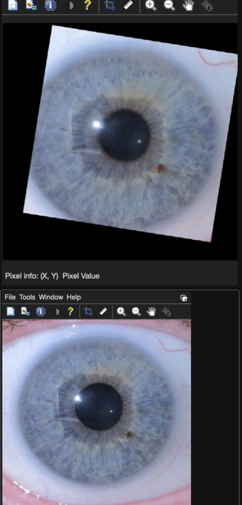
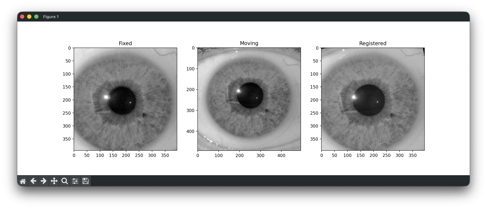

# 👁️ Eye Pupil Dilation Measurement using Image Registration

<div align="center">


A Computer Vision project that measures pupil dilation by aligning eye images using feature-based image registration and then estimating pupil diameter changes.

</div>

---

# 📖 Overview

Pupil size measurements can be inaccurate when images are captured from slightly different viewpoints, angles, or eye positions.

This project solves that problem by:

✅ Detecting and matching visual features in the iris

✅ Registering (aligning) the eye images

✅ Measuring pupil diameter

✅ Calculating percentage dilation

The project was first implemented in **MATLAB using SURF-based Registration Estimator**, then reproduced in **Python using OpenCV and SIFT feature matching**.

---

# 🎯 Problem Statement

Given two images of the same eye:

| Before | After |
|----------|----------|
|  |  |

Determine how much the pupil size has changed while compensating for:

- Eye movement
- Rotation
- Camera misalignment
- Scale variation

---

# 🏗️ System Architecture

```text
                    Eye Image 1
                          │
                          ▼
                Feature Detection
                          │
                          ▼
                  Feature Matching
                          │
                          ▼
            Geometric Transformation
                          │
                          ▼
                 Image Registration
                          │
                          ▼
                Registered Eye Image
                          │
                          ▼
                 Pupil Segmentation
                          │
                          ▼
                 Diameter Estimation
                          │
                          ▼
               Percentage Dilation
```

---

# 🔬 Methodology

The project follows a two-stage pipeline:

## Stage 1 — Image Registration

The goal is to align both images into the same coordinate system.

### Registration Workflow

```text
              Fixed Image
                    ▲
                    │
                    │
             Feature Matching
                    │
                    ▼
             Moving Image
                    │
                    ▼
         Estimate Transformation
                    │
                    ▼
             Warp Image
                    │
                    ▼
          Registered Image
```

---

## MATLAB Implementation

The MATLAB Registration Estimator App was used to:

- Detect SURF Features
- Match Corresponding Points
- Estimate Rigid Transformation
- Warp Moving Image

### Registration Estimator



---

### Generated Registered Image

After registration, the moving image is transformed to align with the fixed image.



---

## MATLAB Registration Pipeline

```text
Fixed Image
      │
      ▼
detectSURFFeatures()
      │
      ▼
extractFeatures()
      │
      ▼
matchFeatures()
      │
      ▼
estgeotform2d()
      │
      ▼
imwarp()
      │
      ▼
Registered Image
```

---

# 🐍 Python Implementation

The same workflow was recreated in Python using OpenCV.

Since SURF is not available in many OpenCV distributions, SIFT was used instead.

---

## Feature Detection

```python
sift = cv.SIFT_create()
```

---

## Feature Matching

```python
matcher = cv.BFMatcher()

matches = matcher.knnMatch(
    des1,
    des2,
    k=2
)
```

Lowe's Ratio Test:

```python
if m.distance < 0.85 * n.distance:
    good_matches.append(m)
```

---

## Transformation Estimation

```python
M, _ = cv.estimateAffinePartial2D(
    pts2,
    pts1,
    method=cv.RANSAC
)
```

---

## Image Registration

```python
eye2_registered = cv.warpAffine(
    eye2,
    M,
    (w,h)
)
```

---

# 📊 Registration Results

## Fixed Image


---

## Moving Image


---

## Registered Image



---

## Comparison

| Fixed | Moving | Registered |
|--------|--------|--------|
|  |  |  |

---

# 🎯 Pupil Detection Pipeline

After registration, pupil diameter is measured automatically.

---

## Processing Workflow

```text
Registered Eye
       │
       ▼
Gaussian Blur
       │
       ▼
Thresholding
       │
       ▼
Contour Detection
       │
       ▼
Largest Contour
       │
       ▼
Circle Fitting
       │
       ▼
Diameter Estimation
```

---

## Gaussian Blur

Noise reduction:

```python
blur = cv.GaussianBlur(
    img,
    (7,7),
    0
)
```

---

## Thresholding

```python
_, thresh = cv.threshold(
    blur,
    50,
    255,
    cv.THRESH_BINARY_INV
)
```

The pupil becomes the largest dark region.

---

## Contour Detection

```python
contours, _ = cv.findContours(
    thresh,
    cv.RETR_EXTERNAL,
    cv.CHAIN_APPROX_SIMPLE
)
```

---

## Circle Fitting

```python
(x,y), radius = cv.minEnclosingCircle(
    contour
)
```

---

## Diameter Estimation

```python
diameter = 2 * radius
```

---

# 📈 Dilation Calculation

Let:

- D₁ = Initial pupil diameter
- D₂ = Final pupil diameter

Then:

```math
Dilation(\%) =
\frac{D_2 - D_1}{D_1}
\times 100
```

### Example

```text
Eye 1 Diameter = 72.1 px

Eye 2 Diameter = 88.4 px

Dilation = 22.61%
```

---

# ⚙️ Technologies Used

| Tool | Purpose |
|--------|--------|
| MATLAB Registration Estimator | Registration |
| SURF | Feature Detection |
| OpenCV | Computer Vision |
| SIFT | Feature Detection |
| NumPy | Numerical Operations |
| Matplotlib | Visualization |

---

# 📂 Project Structure

```text
EyeContrast/
│
├── eye1.jpg
├── eye2.jpg
│
├── registerImages.m
├── main.py
│
├── docs/
│   ├── eye1.jpg
│   ├── eye2.jpg
│   ├── matlab_registration_overlay.png
│   ├── matlab_registered_result.png
│   ├── python_registered.png
│
└── README.md
```

---

# 🚀 Running the Project

## MATLAB

```matlab
eye1 = imread("eye1.jpg");
eye2 = imread("eye2.jpg");

reg = registerImages(eye1, eye2);
```

---

## Python

Install dependencies:

```bash
pip install opencv-python numpy matplotlib
```

Run:

```bash
python main.py
```

---

# 📋 Results

### MATLAB

- SURF-based Registration
- Registration Estimator Validation
- Successful Eye Alignment

### Python

- SIFT-based Registration
- Automatic Pupil Diameter Estimation
- Dilation Percentage Computation

---

# 🔮 Future Improvements

### Registration

- ORB Features
- BRISK Features
- AKAZE Features

### Pupil Detection

- Ellipse Fitting
- Hough Circle Transform
- Deep Learning Segmentation

### Real-Time Analysis

- Webcam Support
- Video Processing
- Live Dilation Tracking

---

# 🧠 Key Learnings

- Feature-Based Image Registration
- SURF and SIFT Feature Extraction
- Feature Matching Techniques
- Geometric Transformations
- Image Warping
- Pupil Segmentation
- Computer Vision Applications in Biomedical Imaging

---

# 👨‍💻 Author

### Yatharth Gupta

Computer Science Engineering Student

Passionate about:

- Computer Vision
- Artificial Intelligence
- Full-Stack Development
- Applied Machine Learning

GitHub: **@YatharthGupta1803**

---

⭐ If you found this project interesting, consider giving it a star.
